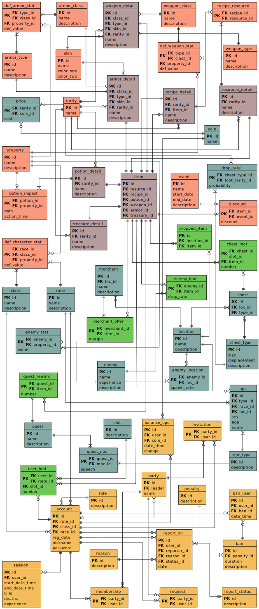

It should become a game-like application, the main part of which is the Postgres database cluster. Using a DBMS without a full-fledged backend is a controversial idea, but it fuels the interest of development and allows for a more in-depth look at the possibilities and the limitations of relational DBs. At the same time, in the game app case, the chosen architecture quite seems to be reasonable. Moreover, the target app does not need a high-volume data transfer, unlike an online FPS, so using a relational DB may even be preferable to a key-value store as an example.

There is a direct connection of clients to the server port. The authentication process is stateful. For connection control, the PgBouncer pool was added. The guest, admin, and player additional schemas are filled with stored procedures. Access control is implemented with those procedures, which allow to interact with data according to the account types. Direct user interaction with data is not possible. So, the public schema of the database is as follows:

